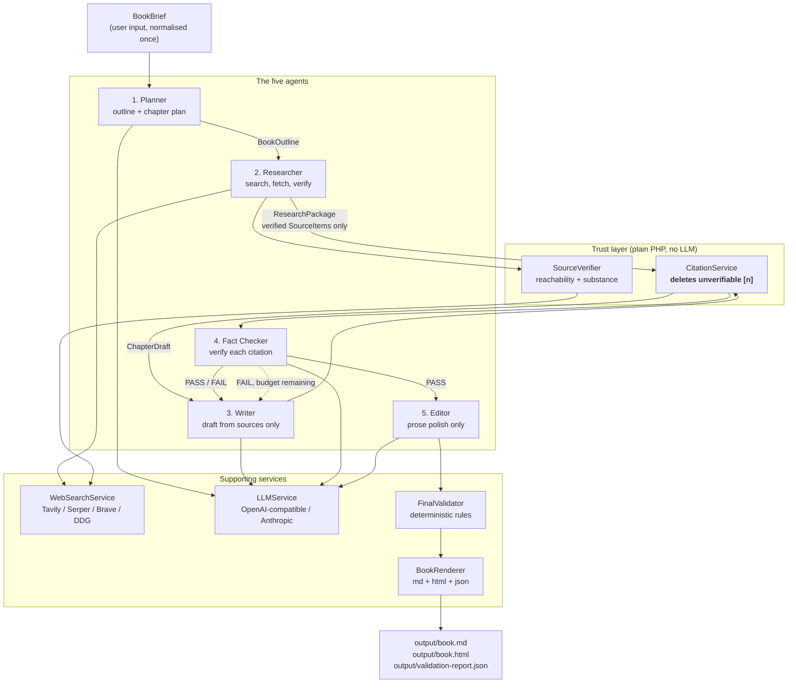

# Multi-Agent Book Writer

A Laravel application that writes a three-chapter book about India's Unified Payments
Interface (UPI) using five cooperating agents, real web research, and numbered
citations that are structurally impossible to fabricate.

No Python is involved anywhere in the application. Everything is PHP 8.2 and
Laravel 12.69, with **zero known dependency vulnerabilities**
(`composer audit` is clean).

---

## How this meets the brief

| Brief requirement | Where it lives |
| --- | --- |
| Planner, Researcher, Writer, Editor, Fact-checker roles | `app/AI/Agents/` — one class each, see [Architecture](#architecture) |
| 3 chapters, 600–900 words each | `config/ai.php` `chapter_count`, `min_chapter_words`, `max_chapter_words` |
| Every fact, figure and date carries `[n]` | `CitationService::enforce()` deletes any marker that does not resolve to a fetched source |
| Reference list per chapter with name, title, link | `BookRenderer` renders a `#### References` block per chapter |
| Sources real and publicly accessible | `SourceVerifier` does an HTTP reachability check; unreachable sources are dropped before drafting |
| Prefer official sources (NPCI, RBI, government) | `config/ai.php` `preferred_domains` rotate first; `AI_TAVILY_INCLUDE_DOMAINS` is a server-side allow-list |
| Sources must not be invented | The Writer is given fetched source text only and may cite nothing else — see [below](#the-problem-this-is-actually-solving) |
| Friendly mentor tone, consistent across chapters | Style rule in `BookBrief`, re-asserted on every revision pass |
| Plain English, no jargon, explain terms on first use | Style rule in `BookBrief` |
| Correct grammar, spelling, punctuation | Editor agent + `ChapterValidator::grammarIssues()` (LanguageTool, local, no LLM tokens) |
| Flowing prose, no bullet points inside chapters | `ChapterValidator` fails the chapter if any bullet is detected |
| Each chapter ends with one `Takeaway:` line, before its references | `ChapterValidator::takeawayLine()` enforces position and count |
| Editor sends chapters back for fixes | Bounded revision loop, `ai.workflow.max_revisions` rounds, then the best candidate wins |
| Fact-checker confirms citations support their claims | `SemanticFactChecker` scores each claim against its source sentence |

---

## The problem this is actually solving

The hard part of an AI book generator is not writing prose. It is that prose gets to
*claim things*. A language model will happily write "UPI processed 16.58 billion
transactions in October 2024 [7]" and invent the `[7]` if you only ask it nicely.

This project treats citation integrity as a code problem rather than a prompting
problem:

> **The Writer is only ever allowed to cite a source that the Researcher already
> fetched and verified. Any `[n]` that does not resolve is deleted before the text
> goes anywhere near the book.**

That is enforced in `CitationService::enforce()`, which every draft passes through.
Asking a model to behave is a request; this is a constraint.

---

## Architecture



### Why this order

Research happens **before** writing, not after. The Writer never sees an unverified
URL because none is ever handed to it. Fact checking happens **before** editing so the
Editor can only ever polish text that already passed verification.

---

## The five agents

| Agent | Responsibility | May call the LLM? |
|---|---|---|
| **Planner** | Turn the brief into a chapter outline with key topics, reader questions and suggested research areas | Yes |
| **Researcher** | Run real web searches, fetch pages, verify them, and select which sources to cite | Yes (for source selection only) |
| **Writer** | Write chapter prose using only the `ResearchPackage` it was given | Yes |
| **Fact Checker** | Verify each citation in two layers: deterministic, then semantic | Yes, only for the semantic layer |
| **Editor** | Improve readability without changing a fact or dropping a citation | Yes |

### Data flows between agents as DTOs, not blobs

Agents exchange typed objects, never large strings:

- `BookBrief` — normalised user input
- `BookOutline` / `ChapterOutline` — the plan
- `ResearchPackage` — contains `SourceItem` objects; **this is the Writer's entire universe of citable facts**
- `ChapterDraft` — prose plus the sources it actually cites
- `FactCheckItem` / `FactCheckResult` — verdicts
- `ValidationReport` — final deterministic report

---

## One definition of a chapter's word count

The shipping policy is 600–900 words, and the counting rule is easy to get subtly
wrong: does the closing `Takeaway:` line count? A live run answered 720 words in one
place and 695 in another for the same chapter.

That is not cosmetic. If the Writer's loop measures the whole body while the
validator measures prose only, a chapter at 595 prose words plus a 25-word Takeaway
clears the loop and then fails validation — with the revision budget already spent.

So `ChapterDraft::wordCount()` counts `proseOnly()`, the same thing the validator
uses. One rule, one method, one number, and a test that pins the Takeaway case.

---

## Fact checking in two layers

Splitting these is the single most useful decision in the codebase, because the two
questions have very different costs and reliability profiles:

**Layer 1, deterministic and free (PHP).** Does the marker resolve to a verified
source? Is the URL valid and reachable? Does the page contain real content rather
than a bot-challenge stub? Code can answer all of these with certainty.

**Layer 2, semantic (LLM).** Does the retrieved page text actually *support the
specific sentence* the marker is attached to? This is the only question code cannot
answer, so it is the only place a model is consulted.

Asking a model "does this URL exist?" wastes tokens and invites confident errors.
Asking PHP "does this page contain 400+ characters of substance?" does not.

### Verdicts

| Verdict | Meaning | Blocks? |
|---|---|---|
| `PASS` | The semantic layer judged that the source text states or directly implies the claim | No |
| `FAIL` | Source contradicts the claim, or clearly does not contain it | **Yes** |
| `UNCERTAIN` | Source is on-topic but does not settle the claim | No, but always reported |

A single `FAIL` blocks the chapter and triggers a revision. `UNCERTAIN` is surfaced
to the writer and shown in the UI, because a source we could not read is not the same
as a source that contradicts the claim.

### A citation earns PASS, or it does not earn PASS

A reachable URL is not a supported claim. Two rules close that gap:

- A citation is only `PASS` if the **semantic layer actually ruled on it**. If the
  model returns a verdict for `[1]` and silently omits `[2]`, then `[2]` is
  `UNCERTAIN`, not `PASS`. This was a live bug: citations were coming back `PASS`
  with the reason *"Pending semantic support check"*, because an existence check was
  being inherited as if it were a support check.
- The Writer is told to keep sourced statements and its own commentary in **separate
  sentences**, and to cite only the former. A sentence mixing a sourced fact with an
  inference fails verification, and rightly so.

---

## The bounded revision loop

This is the requirement most systems get wrong, usually by either looping forever or
giving up on the first failure.

```php
for ($attempt = 0; $attempt <= $maxRevisions; $attempt++) {
    $draft = $writer->write(...);              // with feedback from last time
    $factCheck = $factChecker->check(...);

    if (no failures && length is correct) {
        return $draft;                          // done
    }

    if ($attempt === $maxRevisions) {
        break;                                  // budget spent, stop
    }

    $feedback = buildFeedback($factCheck, $lengthProblem);
}
```

Three properties matter:

1. **Bounded per chapter** by `MAX_REVISIONS` (default 2). When the budget is spent
   the chapter moves on with its problems *recorded*, not silently dropped and not
   retried forever.
2. **Everything the validator will reject is a revision trigger**, not just length.
   A missing or duplicated `Takeaway` line, text after the `Takeaway`, or a chapter
   with no citations at all sends the chapter back to the Writer. Without this the
   loop can converge on a chapter that was never shippable.
3. **An agent that throws never takes the run down.** The exception is logged,
   surfaced in the UI and included in the report.

### The Editor cannot break a chapter

Editing happens after fact checking, so a well-meaning edit could still remove the
`Takeaway` line or drop a citation. This happened in a live run. The edited draft is
therefore re-checked against the structural rules and its citation set, and **if it
regressed it is discarded in favour of the already-verified draft**. The Editor is an
optional improvement; it never gets the last word on correctness.

### Verification that did not happen is not a pass

The FactChecker runs inside a `try/catch` so one bad chapter cannot take down the
whole run. That resilience has a sharp edge: a crashed FactChecker used to produce a
chapter with no fact-check result, which reached the validator looking exactly like a
clean one and shipped with unverified citations.

A missing fact-check result is now a chapter **error**. If verification did not
complete, the book does not ship.

### The Editor is verified too, not just policed

Guarding the Editor structurally is necessary but not sufficient: an edit can keep
every citation, keep the `Takeaway`, and still drift away from what the source says.
Editing for meaning is exactly the kind of change that needs re-checking.

So the edited draft goes back through the Fact Checker. If the re-check fails — **or
cannot run** — the edit is discarded and the pre-edit draft ships, because an edit we
cannot verify is an edit we do not publish. When an edit is accepted, the stored
verdict is replaced with the post-edit one, so the report always describes the text
that actually ships.

In a live run this caught two bad edits across three chapters. The rejected edits stay
visible in the run log rather than vanishing.

---

## Source diversity is enforced, not requested

Ranked purely by content length, the candidate pool hands the model one publisher's
pages every time — PIB publishes long pages, so PIB took every slot and chapters came
out citing a single organisation.

Asking the model to diversify does not fix this, because every alternative has already
been filtered out before it sees the catalogue. Two caps do:

| Setting | Default | Effect |
|---|---|---|
| `MAX_CANDIDATES_PER_DOMAIN` | `3` | How many pages one domain may put in the catalogue offered to the Researcher |
| `MAX_SOURCES_PER_DOMAIN` | `2` | How many one domain may contribute to a finished chapter |

Official domains rotate first, so breadth never promotes a content farm ahead of the
regulator. On top of that, `blocked_domains` keeps UGC sites, content farms and
document dumps out of the pipeline entirely.

Diversity is capped, not unbounded: if a topic genuinely has one authoritative source,
a second weaker one will not be invented to fill the quota.

`tests/Feature/RevisionLoopTest.php` drives three revisions through the loop in
milliseconds using test doubles and asserts the loop stops at exactly the budget.

---

## Setup

Requirements: PHP 8.2+, Composer.

```bash
composer install
cp .env.example .env
php artisan key:generate
php artisan migrate
```

`php artisan migrate` creates the tables, including the `jobs` table the queue
worker needs. Without it the worker starts but every generation fails with
`no such table: jobs`.

Add your API keys to `.env`:

```dotenv
AI_LLM_API_KEY=sk-or-v1-...
AI_SEARCH_API_KEY=tvly-...
```

`.env` is gitignored and `.env.example` ships with blank values, so no secret is
ever committed.

### Running it

Generation is queued, so start a worker **first**, in its own terminal:

```bash
php artisan queue:work
```

Then serve the app:

```bash
php artisan serve
```

Open <http://localhost:8000>, enter a title and audience, and press
**Start generation**. You are redirected immediately, and the run page
self-refreshes every five seconds until the run finishes.

The pipeline performs many live search and LLM calls, so a full three-chapter run
takes roughly **four to five minutes**.

**About the queue.** This project ships with `QUEUE_CONNECTION=database` in `.env`
because `sync` runs the whole pipeline inside the HTTP request — the browser would
sit on a blank page for five minutes and Apache's `max_execution_time` could kill the
request part-way through. With a database queue the POST returns instantly and the
work happens in the worker.

That setting is the one reason a database is now involved. Run documents are still
plain JSON files and nothing else needs SQL. To go back to the zero-setup default,
set `QUEUE_CONNECTION=sync` — the queue tables can stay, they are simply unused.

> **If you skip the worker, clicks appear to do nothing.** A queued job is not a run
> record until a worker picks it up, so with an empty queue and no worker the runs
> table simply will not grow. `php artisan queue:failed` shows anything that threw.

### The runs table

| Column | Meaning |
|---|---|
| Title | From the brief. Falls back to `Untitled` only for records written before the title-persistence fix |
| Status | `RUNNING`, `PASSED` or `FAILED` |
| Chapters / Words | Chapter count and total prose words |
| Took | Wall-clock seconds, or `—` while still running |
| Finished | `dd/mm/yy hh:mm:ss` in **India Standard Time**, or `—` while still running |

Timestamps are stored as absolute ISO-8601 in UTC and converted only for display, so
they never drift if the server or `APP_TIMEZONE` changes.

---

## Configuration

Everything tunable lives in `config/ai.php`:

| Key | Default | Meaning |
|---|---|---|
| `MAX_REVISIONS` | `2` | Revision attempts per chapter |
| `CHAPTER_COUNT` | `3` | Number of chapters |
| `MIN_CHAPTER_WORDS` | `600` | Minimum prose words per chapter |
| `MAX_CHAPTER_WORDS` | `900` | Maximum prose words per chapter |
| `MAX_CANDIDATES_PER_DOMAIN` | `3` | Catalogue cap per domain, to force breadth |
| `MAX_SOURCES_PER_DOMAIN` | `2` | Citation cap per domain in a chapter |
| `AI_LLM_PROVIDER` | `openai` | `openai`, `anthropic` or `null` |
| `AI_LLM_MODEL` | `openai/gpt-4o-mini` | Any OpenAI-compatible model id |
| `AI_SEARCH_PROVIDER` | `tavily` | `tavily`, `serper`, `brave`, `duckduckgo` or `null` |

### Swapping providers

Agents depend on `LLMInterface` and `SearchProviderInterface`, never on a vendor SDK.
Switching from OpenRouter to OpenAI, or from Tavily to Brave, is a `.env` change.
`AIServiceProvider` is the single place the bindings live.

The LLM service sends real `json_schema` structured-output requests and degrades
gracefully (`json_schema` → `json_object` → plain prose) when a provider rejects them,
because support for strict schemas varies widely across OpenAI-compatible servers.
Degradation only happens when the rejection is actually about output shape: a 402 out
of credit or a 429 rate limit fails immediately rather than spending three requests to
reach the same wall.

---

## Source verification

A URL returning `200 OK` is not evidence of anything. Several Indian government sites
return a small bot-challenge page with a success status, and `npci.org.in` in
particular can serve an 82-byte title-only stub.

`SourceVerifier` therefore requires:

- a reachable URL that returns `200`
- **at least 400 characters of substantive text** (configurable)
- a domain that is not on the blocked list (Wikipedia, Quora, Medium, Reddit, ...)

Official Indian domains (`npci.org.in`, `rbi.org.in`, `pib.gov.in`,
`financialservices.gov.in`, ...) are preferred and searched first. Direct retrieval
from several of these hosts is bot-blocked, which is why the search provider fetches
page text server-side rather than relying on local `curl`.

---

## Tests

```bash
php artisan test
```

94 tests, 231 assertions. They cover the logic that prompts cannot enforce:

| Suite | What it proves |
|---|---|
| `TextUtilsTest` | Word counting handles decimals, hyphens and URLs correctly |
| `CitationEnforcementTest` | An invented `[7]` is deleted; gaps are renumbered without corrupting markers |
| `FinalValidatorTest` | Every rule: length, bullets, Takeaway placement, zero citations, unresolved fact-check failures, **and that a chapter with no fact check is not treated as verified** |
| `AgentBehaviourTest` | A deterministic failure outweighs a model `PASS`; an unjudged citation is never `PASS`; one publisher cannot take every slot; a blocked domain can never be cited; distinct official publishers are not merged into one |
| `RevisionLoopTest` | The loop stops at exactly `MAX_REVISIONS`; length is measured on prose; a structurally destructive edit is discarded; an edit that fails re-verification is discarded |
| `LLMServiceTest` | The output ladder walks `json_schema` → `json_object` → prose, and does **not** retry weaker shapes when the failure was never about output shape |
| `BookUiTest` | Routes, validation, run storage, path-traversal safety; the runs table renders a real title and a `dd/mm/yy hh:mm:ss` IST timestamp |
| `BookGeneratorTest` | An aborted run still persists its title; `finished_at` is only set once a run completes; timestamps render in IST regardless of `APP_TIMEZONE` |

The agent and pipeline tests use `FakeLLM` and `FakeSearch` doubles, so the whole
suite runs in about 1.5 seconds with **no network calls and no API keys required**.

Nine real bugs found this way, all now fixed and covered:

- `TextUtils::stripMarkdown()` stripped `[n]` markers before sentence splitting, which
  destroyed claim-to-citation attribution and made the Fact Checker fall back to
  whole-paragraph granularity.
- Citation numbering was inherited from the research package, so a chapter citing only
  some of its sources shipped a reference list like `[1], [2], [6]`.
- A citation the model never judged inherited its `existence` check and was reported
  as `PASS` with the reason *"Pending semantic support check"*. Silent passes are
  worse than failures in a system like this one.
- The revision loop only treated length as a fixable problem, so a missing `Takeaway`
  exhausted the budget without the Writer ever being told.
- The Editor silently deleted a clean draft's `Takeaway` line, and the orchestrator
  accepted the result.
- Chapters were citing a single publisher because the candidate pool was ranked by
  content length and one publisher's long pages won every slot.
- The diversity cap grouped publishers by their last two labels, so NPCI, the RBI and
  every other `*.org.in` host counted as one publisher, and PIB, the Finance Ministry
  and data.gov.in counted as one. The cap meant to spread citations across trusted
  sources was rationing slots between different regulators.
- A `TypeError` in the diversity rotation meant every live run silently lost its
  research results.
- The structured-output fallback had two rungs but was documented as three: the
  plain-prose tier could never be reached.
- The run record was overwritten rather than merged, and the orchestrator aborts on a
  planner or researcher failure without returning the brief. Every early failure lost
  its title and the runs table fell back to `Untitled`.

Ten real bugs found this way, all now fixed and covered.

The renderer and the run store both write real files, so the tests that touch them
redirect `ai.workflow.output_dir` and `ai.storage.runs_path` to temp directories.
Without that, running the test suite would overwrite the deliverables in `output/` and
delete real run history.

---

## Project layout

```
app/AI/
  Agents/         PlannerAgent, ResearcherAgent, WriterAgent, FactCheckerAgent, EditorAgent
  DTO/            Typed objects passed between agents
  Services/       CitationService, SourceVerifier, FinalValidator, BookRenderer,
                  WorkflowOrchestrator, LLMService, WebSearchService, RunStore
  Interfaces/     LLMInterface, SearchProviderInterface
  Helpers/        TextUtils
  Exceptions/     AgentException
app/Http/Controllers/BookController.php
app/Jobs/GenerateBookJob.php
resources/views/book/  index (form + run list), show (result + progress log)
output/                 book.md, book.html, validation-report.json
```

There is no database. Run documents are plain JSON files under `storage/app/runs`;
swapping `RunStore` for an Eloquent model is the only change persistence would need.

---

## Output artifacts

| File | Contents |
|---|---|
| `output/book.md` | The finished book, with a `References` block per chapter |
| `output/book.html` | The same book as a standalone, dependency-free page |
| `output/validation-report.json` | Per-chapter verdicts, warnings and the final pass/fail |

Every completed run is also persisted to `storage/app/runs/<id>.json`, including the
full chapter prose and event log. The renderer is deterministic, so artifacts can be
rebuilt from a stored run without spending a single API call:

```
php re_render.php            # newest successful run
php re_render.php 20261004-050646-qbt5r8
```

This is also the recovery path if `output/` is cleared by accident.

Each run writes three files to `output/`:

- **`book.md`** — the finished book, per-chapter references included
- **`book.html`** — the same book, standalone and self-contained for reading
- **`validation-report.json`** — per-chapter word counts, citation counts, Takeaway
  verdict, fact-check tallies, plus every error and warning

The JSON report is the honest one: it reports the run as failed if any citation still
fails fact checking after the revision budget is spent, rather than quietly shipping.

---

## Honest limitations

- **A revision budget spent on a stubborn chapter does mean a shipped chapter with a
  recorded fact-check failure.** The alternative is an unbounded loop. The failure is
  surfaced in the report and the UI, not hidden.
- **`UNCERTAIN` does not block.** A source that could not be fetched is not treated as
  a refutation. Under the strictest reading you could make `UNCERTAIN` blocking, at
  the cost of stalling on every bot-blocked government page. Live runs typically end
  with one or two.
- **Diversity is capped, not guaranteed.** The caps stop one publisher from taking
  every slot, but search results decide what is available, and a payment company's own
  documentation (`razorpay.com`, `m2pfintech.com`) will be used where a regulator page
  does not exist. Legitimate for a practical guide, weaker than a regulator's page.
  Note that the committed artifact in `output/` was generated *before* `ssrn.com` was
  added to the blocklist, so it still cites it; the next live run will not.
- **A chapter can still cite very few sources.** `MIN_SOURCES_PER_CHAPTER` is a
  suggestion in the Researcher's prompt, not an enforced minimum, so one live chapter
  ran 788 words on a single citation. Enforcing a floor would need a revision trigger,
  which risks burning the budget on something the Writer cannot fix.
- **Semantic verification is still a model judgement.** The deterministic layer is
  certain; the "does this sentence follow from this page" layer is not. A confident
  model can mark an unsupported claim as `PASS`. The two-layer split keeps that risk
  in one identifiable place instead of spreading it across the pipeline.